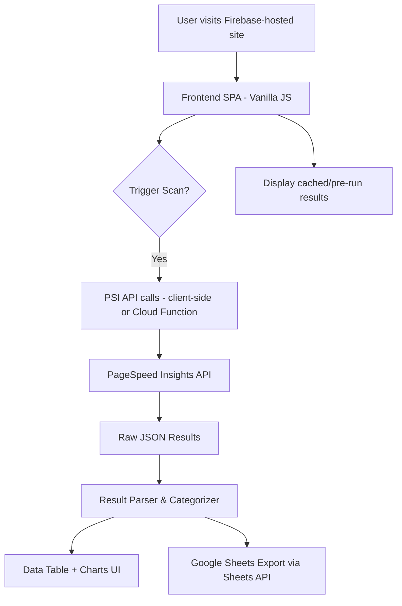

# 🇬🇭 Ghana Web Performance Scanner — Implementation Plan

## Overview

A visually rich, data-driven web tool that runs Google PageSpeed Insights (PSI) audits on 20 curated Ghanaian websites. Results are categorized by sector, key issues are surfaced, and concrete recommendations are made — all deployed to Firebase Hosting.

---

## 🏗️ Architecture



> [!NOTE]
> Since the PSI API has rate limits and latency (~2–5s per site), we'll **pre-run all 20 audits** and cache the results in a JSON file bundled with the app. The UI will also support live re-scanning triggered by the user.

---

## 🛠️ Tech Stack

| Layer | Technology | Rationale |
|---|---|---|
| Frontend | **Vanilla JS + HTML/CSS** | Lightweight, no build step, fast |
| Charts | **Chart.js** | Simple, beautiful charts via CDN |
| API | **PageSpeed Insights API v5** | Free, returns CWV + audit data |
| Hosting | **Firebase Hosting** | Free tier, CDN-backed, easy CLI deploy |
| Data Export | **Google Sheets API** | Write scan results to a sheet for analysis |
| Caching | **JSON flat file** | Pre-run results stored in `data/results.json` |
| (Optional) Backend | **Firebase Cloud Functions** | Proxy PSI calls to avoid CORS/key exposure |

---

## 🌐 The 20 Ghanaian Websites

Curated across 4 sectors:

### 📰 News / Media (5)
| # | Site | URL |
|---|---|---|
| 1 | MyJoyOnline | myjoyonline.com |
| 2 | GhanaWeb | ghanaweb.com |
| 3 | Graphic Online | graphic.com.gh |
| 4 | Citinewsroom | citinewsroom.com |
| 5 | Pulse Ghana | pulse.com.gh |

### 🏦 Banking / Finance (5)
| # | Site | URL |
|---|---|---|
| 6 | GCB Bank | gcbbank.com.gh |
| 7 | Absa Ghana | absa.com.gh |
| 8 | Stanbic Ghana | stanbicbank.com.gh |
| 9 | Ecobank Ghana | ecobank.com |
| 10 | MTN MoMo | mtn.com.gh |

### 🛒 E-Commerce / Tech (5)
| # | Site | URL |
|---|---|---|
| 11 | Jumia Ghana | jumia.com.gh |
| 12 | Tonaton | tonaton.com |
| 13 | Melcom | melcom.com |
| 14 | Hubtel | hubtel.com |
| 15 | Paystack Ghana | paystack.com |

### 🏛️ Government / Education (5)
| # | Site | URL |
|---|---|---|
| 16 | Ghana.gov.gh | ghana.gov.gh |
| 17 | GRA | gra.gov.gh |
| 18 | University of Ghana | ug.edu.gh |
| 19 | KNUST | knust.edu.gh |
| 20 | NHIS Ghana | nhis.gov.gh |

---

## 📊 Data We're Collecting Per Site

From the PSI API response, we extract:

### Core Web Vitals
- **LCP** — Largest Contentful Paint (target: < 2.5s)
- **FID / INP** — Interaction to Next Paint (target: < 200ms)
- **CLS** — Cumulative Layout Shift (target: < 0.1)
- **FCP** — First Contentful Paint
- **TTFB** — Time to First Byte
- **Speed Index**

### Performance Score (0–100)

### Key Audit Flags (true/false with impact level)
- Unoptimized images (`uses-optimized-images`)
- Render-blocking resources (`render-blocking-resources`)
- Unused JavaScript (`unused-javascript`)
- Unused CSS (`unused-css-rules`)
- No HTTPS (`is-on-https`)
- No text compression (`uses-text-compression`)
- Missing `alt` attributes on images
- Large network payloads (`total-byte-weight`)

### Lighthouse Categories
- Performance, Accessibility, Best Practices, SEO

---

## 📐 Frontend Page Structure

```
index.html
├── Hero Section — Title, subtitle, "Last scanned: [date]"
├── Summary Cards — Avg Score, Best Site, Worst Site, Most Common Issue
├── Filter Bar — [All] [News] [Banking] [E-Commerce] [Government]
├── Results Table — Sortable columns: Site | Score | LCP | CLS | Category | Issues
├── Issue Breakdown Section — Bar chart of most common audit failures
├── CWV Distribution — Scatter or grouped bar chart
├── Recommendations Section — Ranked list of concrete fixes
└── Footer — "Data from Google PageSpeed Insights API"
```

---

## 🔄 Data Pipeline

### Phase 1: Pre-run Data Collection (Script)
```
scripts/
└── run_audit.js     ← Node.js script using fetch() to call PSI API
                        Outputs → data/results.json
```

Run locally with:
```bash
node scripts/run_audit.js
```

This generates `data/results.json` with all 20 site results. This file is committed and deployed with the app.

### Phase 2: Google Sheets Export (Optional Live Sync)
- Use **Google Sheets API** to write results to a sheet
- Sheet columns: Site, Category, Score, LCP, CLS, FCP, TTFB, Issues
- Sheet serves as a live data source / audit log

### Phase 3: Live Rescan (Optional)
- "Rescan" button on the UI
- Makes PSI API calls directly from the browser (API key required)
- Results shown instantly without page reload

---

## 🚀 Firebase Hosting Deployment

### Project Structure
```
ghana-web-perf-scanner/
├── public/
│   ├── index.html
│   ├── css/
│   │   └── styles.css
│   ├── js/
│   │   ├── app.js          ← Main app logic
│   │   ├── scanner.js      ← PSI API calls
│   │   ├── renderer.js     ← DOM rendering
│   │   └── charts.js       ← Chart.js setup
│   └── data/
│       └── results.json    ← Pre-run audit data
├── scripts/
│   └── run_audit.js        ← Node.js audit runner
├── firebase.json
└── .firebaserc
```

### Deploy Steps
```bash
npm install -g firebase-tools
firebase login
firebase init hosting    ← public dir: public/
firebase deploy
```

---

## 🎨 Design Direction

- **Dark theme** with accent color inspired by Ghana flag colors (🟡 gold, 🟢 green, 🔴 red)
- Performance score displayed as **color-coded rings** (red < 50, orange 50–89, green 90+)
- **Animated score counters** on page load
- **Sortable, filterable data table** with hover highlights
- Responsive — works on mobile
- Typography: **Inter** from Google Fonts

---

## 📅 Build Phases

| Phase | Tasks | Output |
|---|---|---|
| **1 — Setup** | Init Firebase project, folder structure, basic HTML shell | Deployable empty shell |
| **2 — Data** | Write `run_audit.js` script, call PSI API, save `results.json` | 20-site dataset |
| **3 — UI Core** | Build table, filter bar, summary cards | Interactive results page |
| **4 — Charts** | Issue breakdown bar chart, CWV scatter/bar | Visual analytics |
| **5 — Recommendations** | Parse common issues, generate recommendations section | Insights panel |
| **6 — Sheets Sync** | Write results to Google Sheet via API | Live data log |
| **7 — Deploy** | Firebase deploy, test live URL | 🚀 Live site |

---

## ⚠️ Key Decisions to Confirm

1. **PSI API Key** — Do you have a Google Cloud project with PSI API enabled? We'll need an API key.
2. **Live Scanning** — Should the UI support live rescans, or is static pre-run data enough?
3. **Google Sheets** — Do you want results exported to Sheets, or is the table in the UI sufficient?
4. **Mobile** — Do you want the PSI audits run in **mobile** mode, **desktop** mode, or both?
5. **Firebase Project** — Do you have an existing Firebase project, or should we create a new one?
